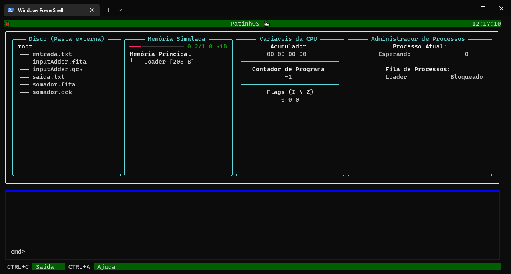

# PCS3446
Projeto da disciplina PCS3446 - Sistemas Operacionais (2022), da graduação em Engenharia Elétrica da POLI-USP.

Consiste em uma aplicação que simule um sistema operacional e seus componentes.



# Instruções de Instalação

Primeiro, instale a biblioteca Textual com 
```
python3 -m pip install textual
```
Depois, na pasta do projeto, execute
```
cd src
python3 main.py
```

# Descrição Detalhada

A aplicação simula um sistema operacional executando em um processador de 32 bits baseado em acumulador, projetado na disciplina PCS3216 - Sistemas de Programação.

A aplicação é chamada de PatinhOS, em homenagem ao primeiro computador feito na universidade, Patinho Feio.


## Processador

O processador é baseado em um único registrador de propósito geral, o acumulador. Instruções e dados possuem 32 bits, sendo 5 bits de opcode e 27 bits de operando.

Há possibilidade de execução multiprogramada, com grau configurável em *./src/pyLib/configs.py*.

## Memória

O sistema possui uma memória principal de tamanho configurável, inicialmente com 1 KiB, particionada com alocação *First Fit* e sem *Garbage Collection*.

Para alterar o tamanho da memória, vá em *./src/pyLib/configs.py* e altere *memoryAddressBits*.

## Disco Virtual

A aplicação possui acesso apenas a pasta **./src/root/**, que é onde os arquivos **.qck** e **.fita** deverão ser armazenados. 